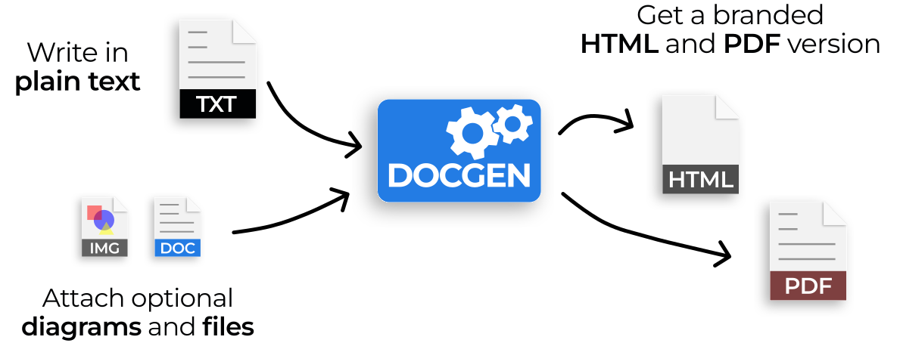
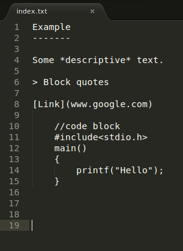
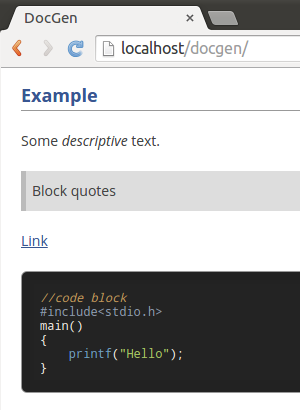
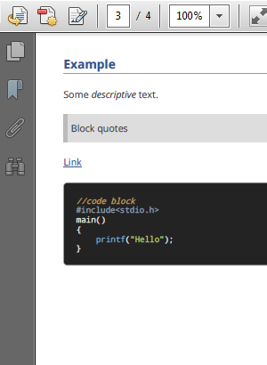



  <h1 class="headline">The Leading Open Source Documentation Tool</h1>
  

   DocGen generates HTML websites and PDF documents from plain text for free.
  

  
  

    <a href="https://github.com/mtmacdonald/docgen/tags" class="button spaced">Download</a>
    <a href="https://github.com/mtmacdonald/docgen/issues" class="button inverted">Report Issues</a>
  

## DocGen is a Static Website Generator

DocGen is an open-source website and PDF generator that makes it easy to create high-quality documentation.

## Features

<ul class="features">
<li>
  
  
<strong>Self-contained website</strong>

  
Creates a static website that works on any server, or as local files.

</li>
<li>
  
  
<strong>Optional PDF</strong>

  
Also publishes the website content as a single PDF, using <a href="https://react-pdf.org/">React-pdf</a>.

</li>
<li>
  
  
<strong>Human-friendly input</strong>

  
Write in plain text, or the human-friendly <a href="http://commonmark.org">Markdown</a> format.

</li>
<li>
  
  
<strong>Easy to version control</strong>

  
Plain text input formats work well with all version control systems.

</li>
<li>
  
  
<strong>Table of contents</strong>

  
Automatically creates tables of contents

</li>
<li>
  
  
<strong>Branding and metadata</strong>

  
Easily brand with a logo, attribute ownership, and attach release notes.

</li>
</ul>

## DocGen is sponsored by Inkit

  

    
  

  

    
DocGen is open-source software sponsored by Inkit, the leading Zero Trust Document Generation Platform.

    <a href="https://www.inkit.com" class="button">Learn More</a>
  

## How it works

Simply <a href="#quick-start">install</a> DocGen, and run the tool to generate websites and PDF documents.

  

    
    
001 | <strong>Create content in plain text or human-friendly <a href="http://commonmark.org">Markdown</a></strong>

  

  

    
    
002 | <strong>DocGen styles and publishes all your content as a website</strong>

  

  

    
    
003 | <strong>DocGen also creates an equivalent PDF copy</strong>

  

  

    <strong>Flexible Input Formats</strong>
    <ul>
      <li>Plain text</li>
      <li>CommonMark (Markdown)</li>
      <li>Image diagrams</li>
    </ul>
  

  

    <strong>Configurable Metadata</strong>
    <ul>
      <li>Branding (logo, title, organization)</li>
      <li>License, copyright, and legal markings</li>
      <li>Ownership and attribution</li>
      <li>Version information</li>
      <li>Release notes (change log)</li>
    </ul>
  

> NOTE: DocGen is intended for free-form, human-generated content which is regularly updated and improved, then
automatically laid out according to a template. It is not intended as a precision PDF editing tool.

## Browser Support

Websites and documents generated by DocGen work in most browsers including [Chrome](https://www.google.com/chrome),
[Edge](https://www.microsoft.com/en-us/edge), [Firefox](https://www.mozilla.org/en-US/firefox/new) and
[Safari](https://www.apple.com/safari).

## Quick Start

In just three steps:

1. **Install DocGen**
2. **Scaffold an empty template**
3. **Generate a static website and PDF**

Simply enter these commands in the terminal:
   
    npx docgen-tool scaffold
    npx docgen-tool run -o $HOME/docgen-example

**See the <a href="installation.html">installation guide</a> for more detailed instructions.**
