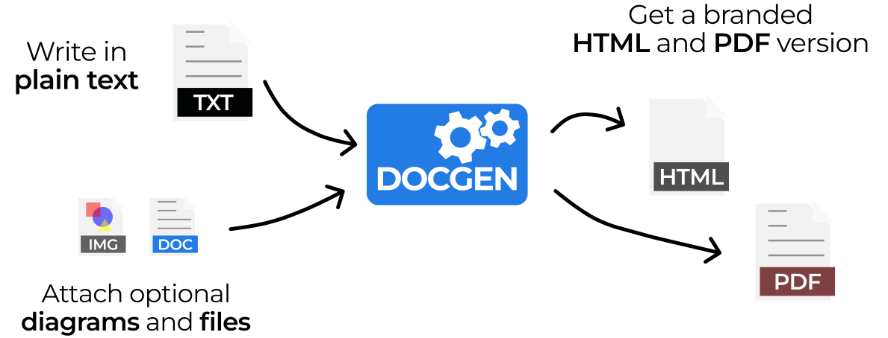
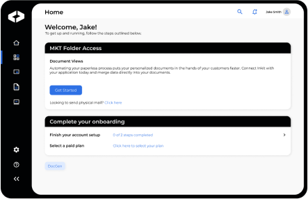
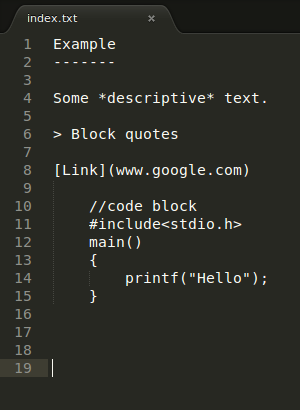
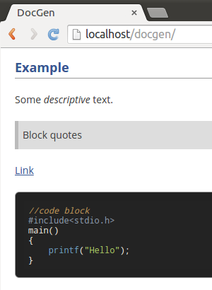
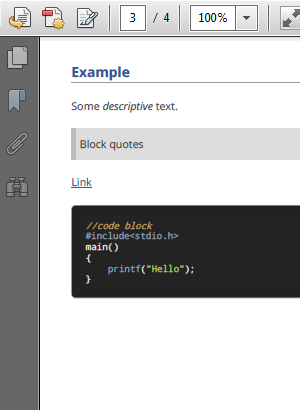



  <h1>The Leading Open Source Documentation Tool</h1>
  

   DocGen generates HTML websites and PDF documents from plain text for free.
  

  

  
  <a href="https://github.com/mtmacdonald/docgen/tags" class="button spaced">
    Download
    
  </a>
  <a href="https://github.com/mtmacdonald/docgen/issues" class="button inverted">Report Issues</a>
  

  <h2>DocGen is a Static Website Generator</h2>
  

  
    DocGen is an open-source website generator that makes it easy to create high-quality documentation.
  
  

<h2 class="dg-hiddenTitle" id="features">Features</h2>

<ul class="features">
<li>
  
  
Self-contained website

  
Creates a static website that works on any server, or as local files.

</li>
<li>
  
  
Optional PDF

  
Also publishes the website content as a single PDF, using <a href="http://wkhtmltopdf.org">wkhtmltopdf</a>.

</li>
<li>
  
  
Human-friendly input

  
Write in plain text, or the human-friendly <a href="http://commonmark.org">Markdown</a> format.

</li>
<li>
  
  
Easy to version control

  
Plain text input formats work well with all version control systems.

</li>
<li>
  
  
Table of contents

  
Automatically creates tables of contents, with links and PDF page numbers.

</li>
<li>
  
  
Code syntax highlighting

  
Automatically highlights code blocks, using <a href="https://highlightjs.org">Highlight.js</a>, with language detection.

</li>
<li>
  
  
Mathematical expressions

  
Displays mathematical expressions without plugins, using either
  <a href="http://khan.github.io/KaTeX/">KaTeX</a> or
  <a href="https://www.mathjax.org">MathJax</a>.

</li>
<li>
  
  
Branding and metadata

  
Easily brand with a logo, attribute ownership, and attach release notes.

</li>
</ul>

<h2>Sponsors</h2>

 

   
 

  

    <h3>DocGen is Sponsored  By Inkit</h3>
    

      DocGen is open-source software sponsored by Inkit, the leading Zero Trust Document Generation Platform.
    

    
<a href="https://www.inkit.com" class="button whiteInverted">Learn More</a>

  

<h2>How it works</h2>

Simply <a href="https://github.com/mtmacdonald/docgen/releases">download</a> or <a href="#quick-start">install</a>
DocGen, and run the tool to generate websites and PDF documents.

  

    
    
001 | <strong>Create content in plain text or human-friendly <a href="http://commonmark.org">Markdown</a></strong>

  

  

    
    
002 | <strong>DocGen styles and publishes all your content as a website</strong>

  

  

    
    
003 | <strong>DocGen also creates an equivalent PDF copy</strong>

  

    

        <strong>Flexible Input Formats</strong>
        <ul>
            <li>Plain text</li>
            <li>CommonMark (Markdown)</li>
            <li>HTML</li>
            <li>LaTeX mathematical expressions</li>
            <li>Image diagrams</li>
            <li>Attach other documents</li>
        <ul>
    

    

       <strong>Configurable Metadata</strong>
        <ul>
          <li>Branding (logo, title, organization)</li>
          <li>License, copyright, and legal markings</li>
          <li>Ownership and attribution</li>
          <li>Version information</li>
          <li>Release notes (change log)</li>
        </ul>
    

<blockquote>
NOTE: DocGen is intended for free-form, human-generated content which is regularly updated and improved, then
automatically laid out according to a template. It is not intended as a precision PDF editing tool.
</blockquote>

<h2 class="browserSupport">Browser support</h2>

  Websites and documents generated by DocGen work in most browsers
  including Chrome, Edge, Firefox and Safari.

  <a href="https://www.google.com/chrome">
    
    
Chrome

  </a>
  <a href="https://www.microsoft.com/en-us/edge">
    
    
Edge

  </a>
  <a href="https://www.mozilla.org/en-US/firefox/new">
    
    
Firefox

  </a>
  <a href="https://www.apple.com/safari">
    
    
Safari

  </a>

<h2 id="quick-start">Quick start</h2>

  

    
In just three steps:

    <ul>
     <li><strong>Install DocGen</strong></li>
     <li><strong>Scaffold an empty template</strong></li>
     <li><strong>Generate a static website</strong></li>
    </ul>
    
Simply enter these commands in the terminal:

  

  

    <pre>
<code>npm install -g docgen-tool
docgen scaffold
docgen run -o $HOME/docgen-example</code></pre>
  

 <strong>
   See the <a href="installation.html">installation guide</a> for more detailed instructions.
 </strong>

