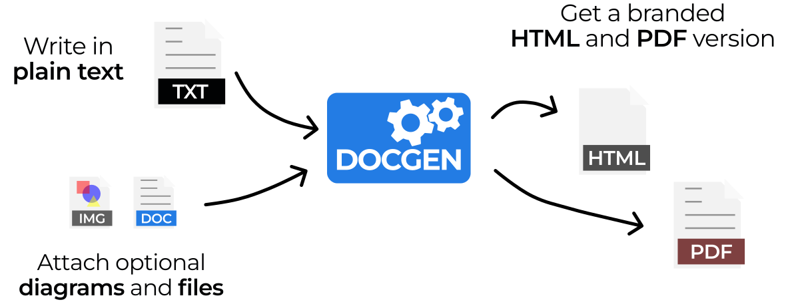



  <h1 class="headline">The Leading Open Source Documentation Tool</h1>
  

   DocGen generates HTML websites and PDF documents from plain text for free.
  

  
  

    <a href="https://github.com/mtmacdonald/docgen/tags" class="button spaced">
      Download
      
    </a>
    <a href="https://github.com/mtmacdonald/docgen/issues" class="button inverted">Report Issues</a>
  

  

    <h2>DocGen is a Static Website Generator</h2>
    

      DocGen is an open-source website generator that makes it easy to create high-quality documentation.
    

  

  <h2 class="dg-hiddenTitle" id="features">Features</h2>
  <ul class="features">
  <li>
    
    <h4>Self-contained website</h4>
    
Creates a static website that works on any server, or as local files.

  </li>
  <li>
    
    <h4>Optional PDF</h4>
    
Also publishes the website content as a single PDF, using <a href="https://react-pdf.org/">React-pdf</a>.

  </li>
  <li>
    
    <h4>Human-friendly input</h4>
    
Write in plain text, or the human-friendly <a href="http://commonmark.org">Markdown</a> format.

  </li>
  <li>
    
    <h4>Easy to version control</h4>
    
Plain text input formats work well with all version control systems.

  </li>
  <li>
    
    <h4>Table of contents</h4>
    
Automatically creates tables of contents, with links and PDF page numbers.

  </li>
  <li>
    
    <h4>Code syntax highlighting</h4>
    
Automatically highlights code blocks, using <a href="https://highlightjs.org">Highlight.js</a>, with language detection.

  </li>
  <li>
    
    <h4>Mathematical expressions</h4>
    
Displays mathematical expressions without plugins, using either
    <a href="http://khan.github.io/KaTeX/">KaTeX</a> or
    <a href="https://www.mathjax.org">MathJax</a>.

  </li>
  <li>
    
    <h4>Branding and metadata</h4>
    
Easily brand with a logo, attribute ownership, and attach release notes.

  </li>
  </ul>

  <h2>Sponsors</h2>
  

    
      <h3>DocGen is sponsored by Inkit</h3>
      

        DocGen is open-source software sponsored by Inkit, the leading Zero Trust Document Generation Platform.
      

      <a href="https://www.inkit.com" class="button whiteInverted">Learn More</a>
  

  <h2>How it works</h2>
  

    Simply <a href="https://github.com/mtmacdonald/docgen/releases">download</a> or <a href="#quick-start">install</a> DocGen, and run the tool to generate websites and PDF documents.
  

  

    

      
      
001 | <strong>Create content in plain text or human-friendly <a href="http://commonmark.org">Markdown</a></strong>

    

    

      
      
002 | <strong>DocGen styles and publishes all your content as a website</strong>

    

    

      
      
003 | <strong>DocGen also creates an equivalent PDF copy</strong>

    

  

  

    <strong>Flexible Input Formats</strong>
    <ul>
      <li>Plain text</li>
      <li>CommonMark (Markdown)</li>
      <li>HTML</li>
      <li>LaTeX mathematical expressions</li>
      <li>Image diagrams</li>
      <li>Attach other documents</li>
    <ul>
  

  

    <strong>Configurable Metadata</strong>
    <ul>
      <li>Branding (logo, title, organization)</li>
      <li>License, copyright, and legal markings</li>
      <li>Ownership and attribution</li>
      <li>Version information</li>
      <li>Release notes (change log)</li>
    </ul>
  

  <blockquote>
  NOTE: DocGen is intended for free-form, human-generated content which is regularly updated and improved, then
  automatically laid out according to a template. It is not intended as a precision PDF editing tool.
  </blockquote>

  <h2>Browser support</h2>
  

    Websites and documents generated by DocGen work in most browsers
    including Chrome, Edge, Firefox and Safari.
  

  

    <a href="https://www.google.com/chrome">
      
      
Chrome

    </a>
    <a href="https://www.microsoft.com/en-us/edge">
      
      
Edge

    </a>
    <a href="https://www.mozilla.org/en-US/firefox/new">
      
      
Firefox

    </a>
    <a href="https://www.apple.com/safari">
      
      
Safari

    </a>
  

  <h2 id="quick-start">Quick start</h2>
  
In just three steps:

  <ol>
    <li><strong>Install DocGen</strong></li>
    <li><strong>Scaffold an empty template</strong></li>
    <li><strong>Generate a static website</strong></li>
  </ol>
  
Simply enter these commands in the terminal:

  <pre><code>npm install -g docgen-tool
docgen scaffold
docgen run -o $HOME/docgen-example</code></pre>
  

    <strong>
      See the <a href="installation.html">installation guide</a> for more detailed instructions.
    </strong>
  

